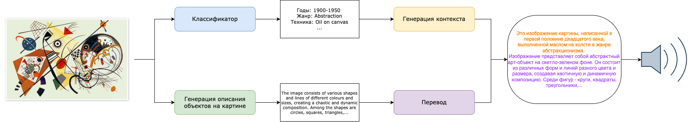
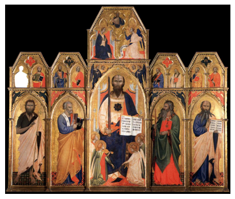

# Art Captioning 

Репозиторий по ВКР 2025 в СПбГУ.

Проект для генерации описаний произведений искусства на русском языке с помощью нейросетей. Позволяет генерировать текстовые описания картин, скульптур и других художественных работ на основе их характеристик.

## Возможности

- Автоматическое генерирование подписей к изображениям на русском языке и аудиофайла с озвучиванием описания
- Работа с классическим и современным искусством
- Возможность дообучения модели классификации

Обратите внимание: для получения более подробного описания, содержащего детали изображения, требуется использовать GPU. Если нет возможности использовать GPU, в файле config.txt измените значение DEVICE с "cuda:0" на None.

## Пайплайн 

Для обучения использовалась выборка из 43,455 изображений предметов искусства датасета [ART500K](https://deepart.hkust.edu.hk/ART500K/art500k.html)

## Пример

**Исходное изображение**:

**Истинные классы**: 
(Panel, religious, Italian, 1351-1400) -> Панно, религиозный, итальянский, 1351-1400 

**Предсказанные классы**: 
Итальянский, религиозный

**Описание на основе классов**: Это произведение (в смешанной технике (не определена)) относится к произведение на религиозный сюжет и выполнено в традициях манеры итальянских мастеров разных эпох (не определены годы создания).

**Тифлокомментарий**: Изображение представляет собой набор из шести панелей, каждый из которых изображает религиозную сцену. Панели расположены в треугольной форме, при этом верхняя панель является самой большой, а нижняя - наименьшей. В центре панели находится большая фигура с длинной бородой и короной шипов на голове. Он держит книгу в руках и, похоже, читает из нее. В окружении него несколько небольших фигур, включая мужчину в синем халате и женщину в красном платье, которые оба имеют книги. С левой стороны панели два человека в белых платьях, один из которых имеет открытую книгу, а другой читает книгу. С обеих сторон они также хранят книги и, как представляется, участвуют в разговоре. Панели украшены золотом и красным акцентом, а фон чёрный. Общий стиль картины является или разветвленным и подробным, с изощренными рисунками и дизайнами.

**Дополненное тифлокомментарием описание**: Это произведение (в смешанной технике (не определена)) относится к произведение на религиозный сюжет и выполнено в традициях манеры итальянских мастеров разных эпох (не определены годы создания). Изображение представляет собой набор из шести панелей, каждый из которых изображает религиозную сцену. Панели расположены в треугольной форме, при этом верхняя панель является самой большой, а нижняя - наименьшей. В центре панели находится большая фигура с длинной бородой и короной шипов на голове. Он держит книгу в руках и, похоже, читает из нее. В окружении него несколько небольших фигур, включая мужчину в синем халате и женщину в красном платье, которые оба имеют книги. С левой стороны панели два человека в белых платьях, один из которых имеет открытую книгу, а другой читает книгу. С обеих сторон они также хранят книги и, как представляется, участвуют в разговоре. Панели украшены золотом и красным акцентом, а фон чёрный. Общий стиль картины является разветвленным и подробным, с изощренными рисунками и дизайнами.

Аудио: assets/example.mp4
